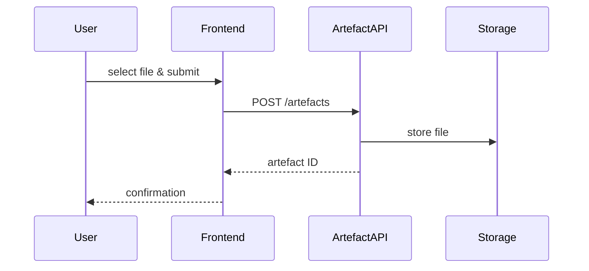
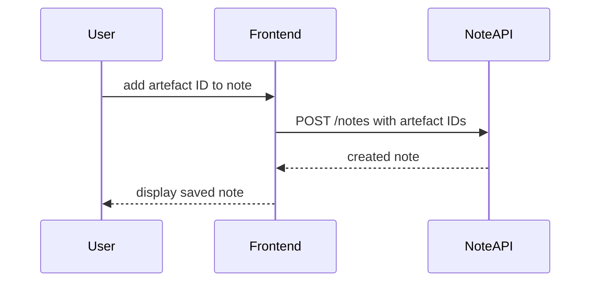
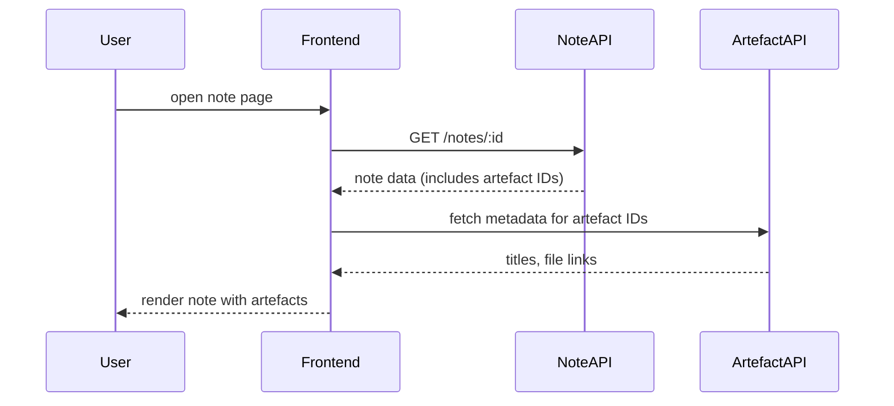

# Artefact Module User Stories

This document outlines high-level user stories for managing artefacts (files or books) and referencing them in notes. It also includes sequence diagrams showing how major interactions flow through the system.

## User Stories

1. **Upload digital artefact**
   - *As a knowledge worker, I want to upload a PDF or image so that it can be referenced later in my notes.*
2. **Register a physical book**
   - *As a researcher, I want to create an artefact record for a physical book by entering its title and other metadata.*
3. **Attach artefacts to a note**
   - *As a note taker, I want to select existing artefacts and link them to a note when editing or creating it.*
4. **Browse artefacts**
   - *As a user, I want to list and search artefacts so I can discover which resources are already stored.*
5. **View artefacts for a note**
   - *As a reader, I want to open a note and see the artefacts it references with links or bibliographic data.*

## Sequence Diagrams

### Uploading a digital artefact

### Attaching artefact to a note

### Viewing a note with artefacts

